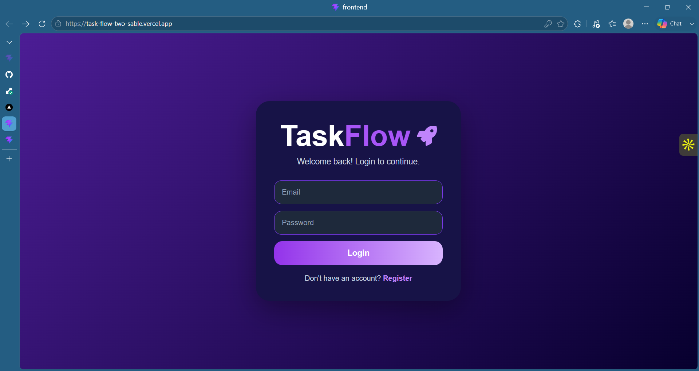
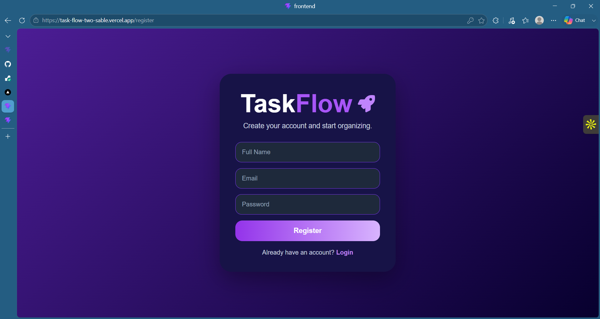
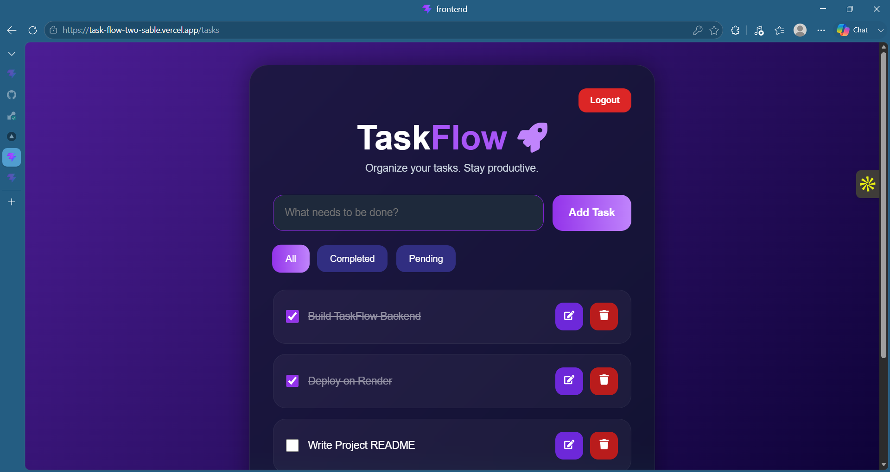
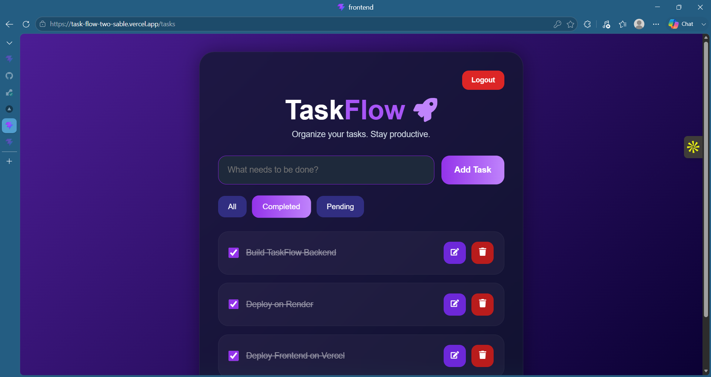
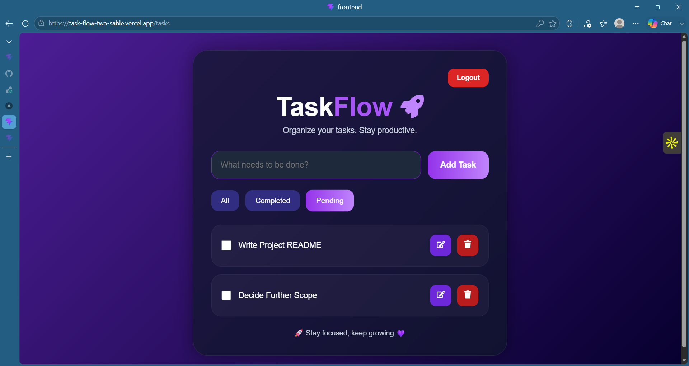

# 🚀 TaskFlow

TaskFlow is a full-stack task management application built using React, Node.js, Express, MongoDB, and JWT Authentication.

The application helps users create, manage, update, and track their daily tasks securely with user-specific task ownership and protected routes.

---

# ✨ Features

## 👤 Authentication Features

- User Registration
- User Login
- JWT Authentication
- Protected Routes
- Secure Logout
- User-specific Task Access

---

## ✅ Task Management Features

- Create Tasks
- View Tasks
- Update Tasks
- Delete Tasks
- Mark Tasks as Completed
- Pending Tasks Filter
- Completed Tasks Filter
- Real-time Task Updates

---

# 🎨 UI/UX Features

- Modern Purple Gradient UI
- Responsive Design
- Empty State Handling
- Smooth Animations
- Professional Authentication Pages
- User-friendly Dashboard
- Clean Task Management Interface

---

# 🛠️ Tech Stack

## Frontend

- React.js
- Vite
- React Router DOM
- Axios
- React Icons
- CSS3

## Backend

- Node.js
- Express.js
- MongoDB Atlas
- Mongoose
- JWT Authentication
- BcryptJS

## API Documentation

- Swagger UI
- Swagger JSDoc

## Deployment

- Vercel (Frontend)
- Render (Backend)

---

# 📸 Screenshots

## Login Page

<p align="center">
  
</p>

---

## Register Page

<p align="center">
  
</p>

---

## All Tasks Dashboard

<p align="center">
  
</p>

---

## Completed Tasks Filter

<p align="center">
  
</p>

---

## Pending Tasks Filter

<p align="center">
  
</p>

---

# ⚙️ Setup Instructions

### 1. Clone Repository

```bash
git clone https://github.com/Meghana-Merla/TaskFlow.git
```

### 2. Frontend Setup

```bash
cd frontend

npm install

npm run dev
```

### 3. Backend Setup

```bash
cd backend

npm install

npm start
```

---

# 🌍 Environment Variables

## Frontend (.env)

```env
VITE_API_URL=https://taskflow-backend-uedi.onrender.com
```

## Backend (.env)

```env
MONGO_URI=your_mongodb_connection_string

JWT_SECRET=your_secret_key

PORT=5000
```

---

# 📂 Project Structure

```text
TaskFlow/
│
├── frontend/
│   ├── src/
│   │   ├── pages/
│   │   ├── components/
│   │   ├── App.jsx
│   │   └── main.jsx
│   │
│   ├── public/
│   ├── package.json
│   └── vite.config.js
│
├── backend/
│   ├── config/
│   ├── middleware/
│   ├── models/
│   ├── routes/
│   ├── server.js
│   └── package.json
│
├── screenshots/
│
└── README.md
```

---

# 🔐 Authentication Flow

1. User registers with email and password
2. Password is hashed using BcryptJS
3. JWT token is generated on login
4. Token is stored in Local Storage
5. Protected routes verify JWT before granting access
6. Users can access only their own tasks

---

# 📖 API Documentation

```text
https://taskflow-backend-uedi.onrender.com/api-docs
```

---

# 🌐 Live Demo

## Frontend

```text
https://task-flow-two-sable.vercel.app/
```

## Backend

```text
https://taskflow-backend-uedi.onrender.com
```

---

# 📌 Future Improvements

- Task Due Dates
- Task Categories
- Search Functionality
- Task Priority Levels
- Drag & Drop Tasks
- Email Notifications
- Task Analytics Dashboard

---

# 📚 What I Learned

- Full Stack MERN Application Development
- JWT-based Authentication and Authorization
- Secure API Design
- MongoDB Atlas Integration
- REST API Development using Express.js
- CRUD Operations with User-specific Data
- Protected Routes in React
- API Documentation using Swagger
- Deployment using Vercel and Render
- Environment Variable Management
- Git and GitHub Workflow

---

# 👩‍💻 Developed By

### Meghana Merla

GitHub:

https://github.com/Meghana-Merla

LinkedIn:

https://www.linkedin.com/in/durga-naga-meghana-merla-9338b7320/